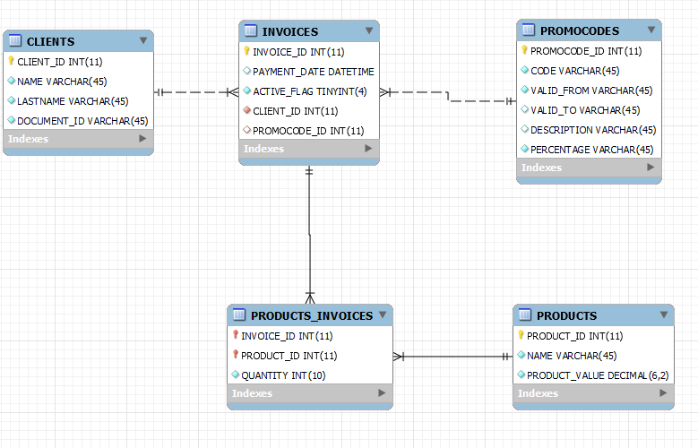
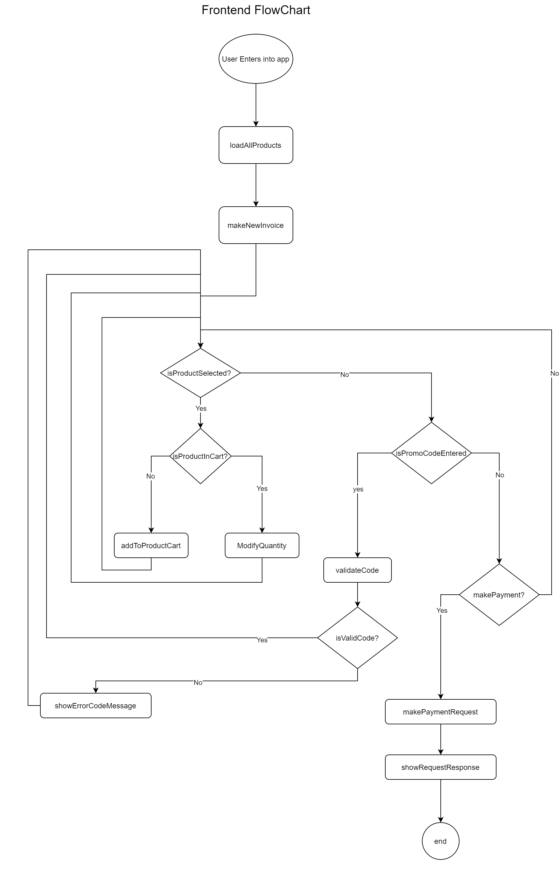
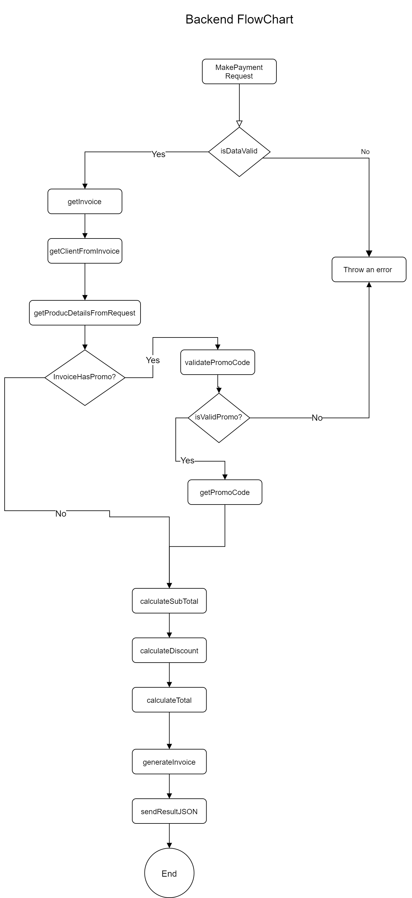

# Invoice Generator (Backend)
This backend API is able to generate invoices given a list of products. 

## Steps to run & deploy
### Load and Connect Database
Database tables have the following relations:

To load this tables,  run the loadTables.sql file from root folder. Modify this file to adapt it to your RDBMM (in this case is written to be run on mysql).

Once you have it, please set the following environment variables:

 - DB_CONN_LIMIT
 - DB_HOST
 - DB_PORT
 - DB_USER
 - DB_PASSWORD
 - DB_DATABASE

by default, system will use localhost and parameters given by [db.config.js](./src/app/config/db.config.js). In case you want to add any other value to pool connection to db please add it here. For more info please refer to  [node-mysql docs](https://www.npmjs.com/package/mysql).

### Running in dev
For running your server in dev environment please use the following command: 

    npm run dev
 If everything is correct you will receive following message in console: 
 

    Server listening on port 3000
port 3000 is the default port and it is not yet configurable.

### Running in Production
For running your server in dev environment please use the following command: 

    npm run start
 If everything is correct you will receive following message in console: 
 

    Server listening on port 3000
port 3000 is the default port and it is not yet configurable.

## Business Logic
This backend's logic is pretty easy and it's explained by following flowchart from Frontend and Backend side: 

## Endpoints
### Get Products
You can get a list of all products using endpoint `/api/products`by a GET HTTP Request, this list is used typically by the FrontEnd for picking values. 
### Get invoices
You can get a list of all invoices using endpoint `/api/invoices` by a GET HTTP Request, this list can be used to access to the full list of invoices by administrator.
### Validate Promo Codes 
In the future you will have the possibility to add Promo Codes before making a payment using the endpoint `/api/promoCodes/validate/{promoCode}` by a GET HTTP Request.
### Make a Payment
In the future you will have the possibility to create invoices using the endpoint `/api/invoices` by a POST HTTP Request.

## To Do

 - Add JSON format for post requests.
 - Add SQL connection capabilities.
 - Fix errors with Invoice service.
 - Add more Unit tests.
 - Deploy example to host.